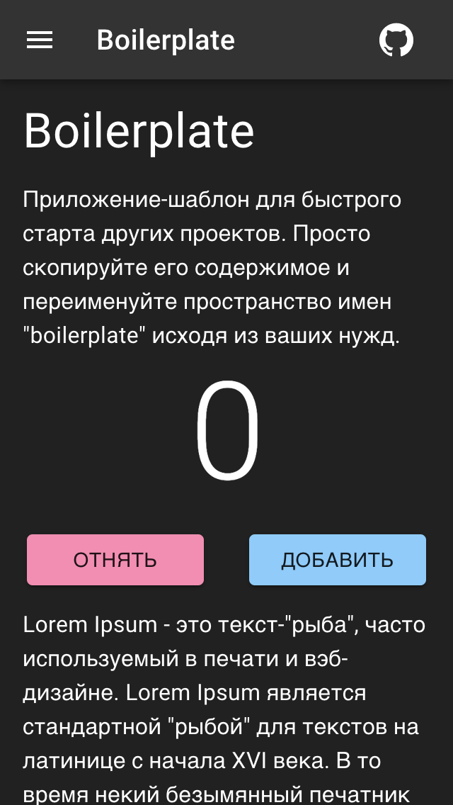

# boilerplate-app

> Шаблон для быстрого старта проекта с material-umd. Просто скопируйте его содержимое и переименуйте пространство имен `boilerplate` исходя из ваших нужд.

## Как запустить?

 - Соберите umd дистрибутив, запустив команды ниже в корне копии этого репозитория

```
pwd # путь material-ui-umd
npm install
npm run build:umd
npm run build:types
```

 - После, соберите это приложение

```
pwd # путь material-ui-umd/packages/boilerplate-app
npm run build
npx open index.html # быстрое открытие файла в браузере
```

 - Для запуска (после сборки) откройте `index.html` в директории приложения

Так же, попробуйте использовать этот инструмент в сочетании с [Apache Cordova](https://cordova.apache.org/). Компоненты пользовательского интерфейса отлично работают с сенсорным экраном.

## Скриншот


