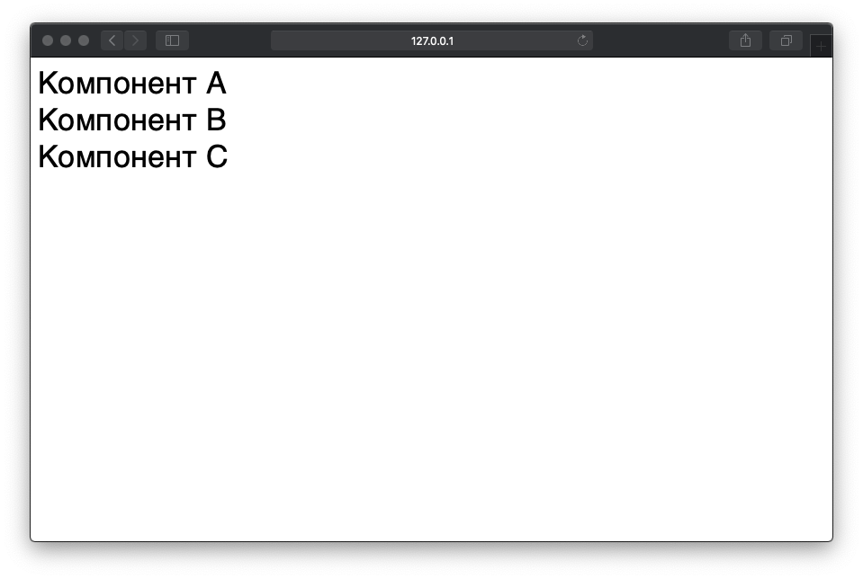

# document-write

> Элегантный способ выйти из положения, если на странице невозможно использовать ES6 модули. Тем не менее, данный метод не избавляет от правильной декомпозиции с избеганием циклических зависимостей и верным порядком подключения скриптов в `index.js` каждой папки



## Как запустить?

 - Соберите umd дистрибутив, запустив команды ниже в корне копии этого репозитория

```
pwd # путь material-ui-umd
npm install
npm run build:umd
npm run build:types
```

 - Откройте `index.html`, запустив веб-сервер

```
pwd # путь material-ui-umd
npm run serve &
npx open-cli http://127.0.0.1:8080/packages/document-write/
```
