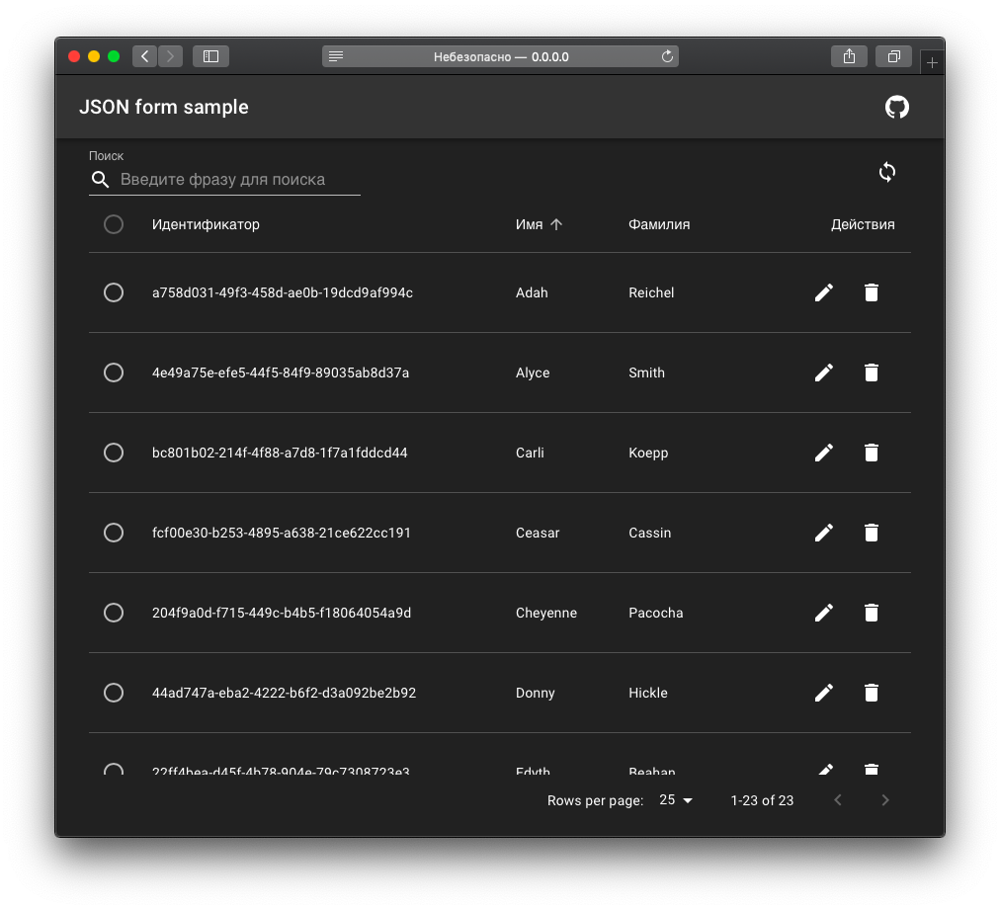
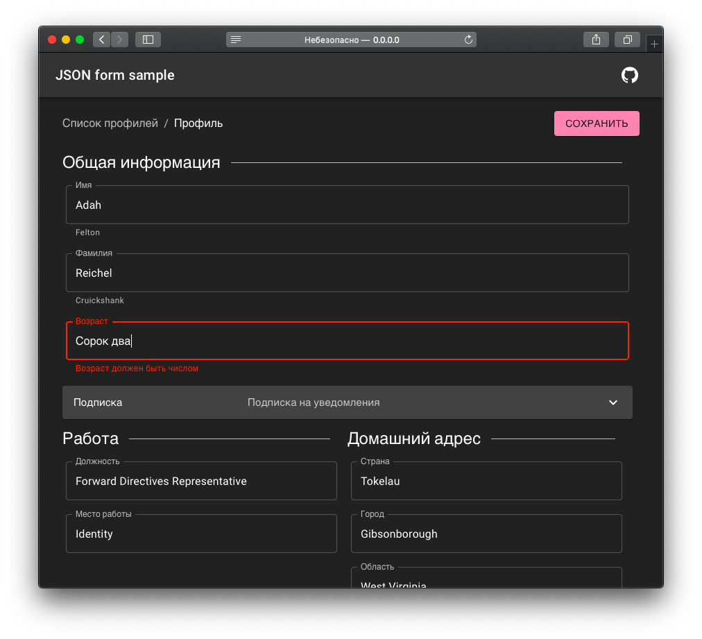

# Form generator app

> Как известно, нормальные люди программируют на html. Но я решил зайти дальше... Представляю вашему вниманию программирование на json-e.

Инструментарий `jsonschema-form` тулкита `material-ui-umd` позволяет до безобразия упростить процесс написания пользовательского интерфейса-обертки SQL запроса на backend с использованием библиотеки [React](https://reactjs.org/). Он предоставляет компонент `List`, осуществляющий вывод json модели в табличное представление с сортировкой по столбцам, строкой поиска, выбором строк и [пагинацией](https://ru.wikipedia.org/wiki/Пагинация). Также там есть компонент `One` непосредственно для форм. Все это дело работает на миниатюрных json шаблонах, основанных на вложенных объектах. Давайте рассмотрим использование `List` на примере простого SQL запроса:

```
SELECT * 
  FROM Profiles
  WHERE FirstName='keyword'
  ORDER BY Year DESC
  LIMIT 10 OFFSET 5;
```

Очень часто в студенческих проектах ставятся требования на применение WHERE, ORDER BY, LIMIT, OFFSET. [Как видно](./src/pages/list.tsx), `List` компонент уже содержит необходимые поля ввода и передает их значения в параметры обработчика (handler), осуществляющего запрос на backend. Подразумевается, что backend вернет общее количество записей (total) и массив элементов (items), которые будут выводиться в таблицу.



Если попытаться сверстать подобную форму на таблицах, весьма вероятно, что табуляции заставят отключить правила линтера на ограничение строки в 120 символов. [Используя json шаблон](./src/pages/one.tsx) `One` компонента, вы сможете сделать ваш компонент действительно миниатюрным, кроме того, это нисколько не повлияет на функциональность: используя коллбеки `isInvalid`, `isVisible` и `isDisabled` вы все так же можете валидировать, скрывать и отключать поля.



Особо примечательно, что прозрачный фон позволяет повторно применять компоненты на странице. Например, `List` компонент можно вставить в диалоговое окно и использовать как пикер элементов списка.

Более детально ознакомиться с исходным кодом и инструкциями по применению в [GitHub репозитории](https://github.com/tripolskypetr/material-ui-umd/tree/master/packages/form-generator-app)
