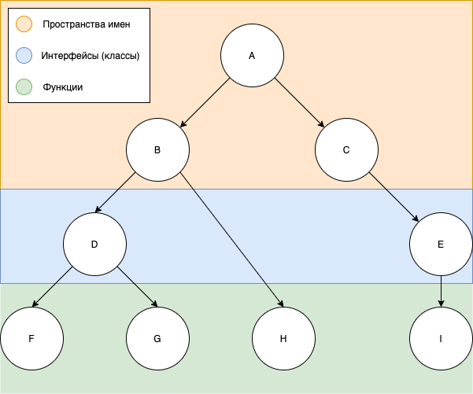

# Создание type definition для umd модуля на основе пространств имен


## Метод 1

> Метод использует обратную компиляцию JavaScript программы, что требует наличия файлов типизации внешних библиотек. Можно попробовать применить заглушку следующего вида: `declare var React: any;`

Оригинальное руководство размещено [тут](https://www.typescriptlang.org/docs/handbook/declaration-files/dts-from-js.html). Попробуйте применить следующий конфиг для TypeScript Compiler:

```
{
  // Change this to match your project
  include: ["src/**/*"],

  compilerOptions: {
    // Tells TypeScript to read JS files, as
    // normally they are ignored as source files
    allowJs: true,
    // Generate d.ts files
    declaration: true,
    // This compiler run should
    // only output d.ts files
    emitDeclarationOnly: true,
    // Types should go into this directory.
    // Removing this would place the .d.ts files
    // next to the .js files
    outDir: "dist",
  },
}
```

Тот же конфиг можно передать без дополнительного файла напрямую из командной строки:

```
npx typescript src/**/*.js --declaration --allowJs --emitDeclarationOnly --outDir types
```

## Метод 2

> Метод основан на получении информации времени исполнения и обработки JavaScript программы как текста, сторонние файлы типизации не требуются

В репозитории в папке /assets/js лежат два скрипта: `generate-closure-externs.js` и `generate-typescript-entries.js`. Они подключаются непосредственно в `index.html`. Первый из них добавляет в глобальный контекст функцию `externs()`, которая имеет один входной параметр позволяет генерировать из umd модуля в глобальном объекте основу для файлов описания типов [Google Closure Compiler](https://developers.google.com/closure/compiler). Они имеют следующее содержание:

```
/**
 * @fileoverview Externs for core generated by generate-closure-externs in browser runtime
 * @see https://gist.github.com/tripolskypetr/ed33439520b59c5077cbdf5d0ff4ea62
 * @externs
 */
var core = {colors:{common:{black:function() { },white:function() { }},red:{
```

Обычно, внутри лежит одна переменная - объект, поля которого либо такие же объекты, либо функции. К ним можно наслаивать JSDoc комментарии, Однако, нам он потребуется исключительно для передачи в функцию `tsEntries()` из второго скрипта. Функция запросит клик по документу и выдаст диалоговое окно выбора сгенерированного на первом этапе файла описания Google Closure Compiler. Выходной файл будет иметь следующий вид:

```
/**
 * @fileoverview Typedefs for material generated by generate-typescript-entries in browser runtime
 * @see https://gist.github.com/tripolskypetr/b9c56202cd98935a49389fb46f77ef19
 */
declare namespace material{export class core{}export class icons{}export class styles{}export class system{}}
```

Над ним рационально применить prettier, команда будет иметь следующий вид: `prettier --write system.d.ts`, а после внимательно посмотреть: обычно, генератор угадывает типы объектов исходя из их вложенности, но иногда назначение типа нужно править мануально. Угадывание происходит по следующему принципу:



 - Нет потомков: функции (методы)
 - Один потомок: интерфейсы (классы)
 - Более одного: пространства имен