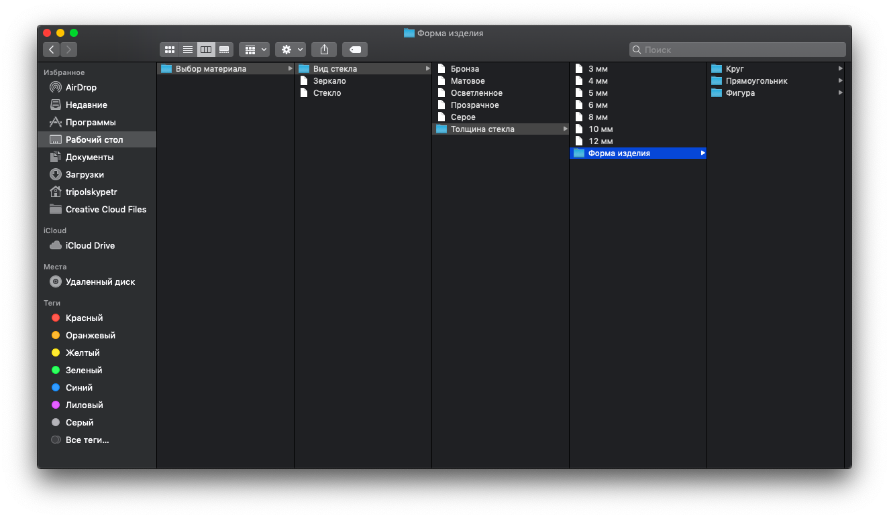

# wordpress-interop

> Пишем React-калькулятор стоимости услуг для сайта на Wordpress

## Введение

Очень часто, при выполнении студенческих или типовых работ на фрилансе, для сайтостроения можно применять готовые решения. Апофеозом подобных решений, на текущий момент, является связка [WordPress](https://ru.wordpress.org/) + [BuddyPress](https://buddypress.org/). BuddyPress это плагин, добавляющий к сайту на WordPress логику социальной сети - Лента активности, Профили, Друзья, Переписка, Группы. Отличительной особенностью связки является возможность применения сторонних плагинов для авторизации, например, OAuth через сервисы Facebook является [корпоративным стандартом стартапов силиконовой долины](https://www.upwork.com/freelance-jobs/wordpress/). Прискорбно, но *мышкой* это фатально быстрее программируется.


Однако, сочетать современные JavaScript фреймворки с WordPress и другими legacy решениями весьма сложно из-за повсеместной завязке на [WebPack](https://webpack.js.org/) или других бандлерах. Под те же ограничения попадают студенческие сайты, которые в 2К20 в Российских институтах требуют верстать на [Bootstrap 3](https://getbootstrap.com/docs/3.4/) и [jQuery](https://jquery.com/).


Заучивание устаревших практик студентами убивает инициативу. Применение устаревших практик на работе тратит время на отладку, мир не просто так дошел до [контейнеров состояния](https://reactjs.org/docs/hooks-state.html). В сочетании с грядущей поддержкой ES6 модулей в браузере и [маппинге импортов](https://github.com/WICG/import-maps), подобная статья становится все более актуальной.


Маловероятно, что я свергну геронтократию в Российских проститутах (Привет, [Bootstrap v3](https://getbootstrap.com/docs/3.4/) и [jQuery](https://jquery.com/), во дворе 2К20), однако, может быть я могу помочь кому-то личностно...

## Пишем калькулятор для сайта

> В отличие от весьма шаблонной авторизации и регистрации, калькуляторы для сайтов всегда персонифицированы под бизнес - их проще писать императивно, а не прокликивать декларативно. Поэтому, приступим к написанию.

## Шаг 1 - попросите заказчика создать древо фильтров файлами и папками

Также, можно сделать самому (скорее всего). Подобная компоновка формы позволит наглядно осмотреть вложенность на предмет ошибок, в идеале переложить работу на чужие плечи.



В папке `src` данного каталога лежит древо папок и `index.js`. Используя следующие скрипты, можно экспортировать древо каталогов как визуально (для описания, как в этой статье), так и в формате json для [One](https://github.com/tripolskypetr/material-ui-umd/blob/master/packages/form-generator-app/STUDENTS.md) компонента.

```
npm start # Древо каталогов для быстрого осмотра на пригодность из консоли
# |-Вид стекла
# | |-Бронза
# | |-Серое
# | |-Толщина стекла
# | | |-10 мм
# | | |-Форма изделия
# | | | |-Круг

npm run generate # JSON, на основе которого в автоматическом режиме будет построена форма
# {
#   "title": "Вид стекла",
#   "type": "group",
#   "fields": [
#     { "title": "Бронза", "type": "string", "name": "Бронза" },
#     { "title": "Серое", "type": "string", "name": "Серое" },
#     {
#       "title": "Толщина стекла",
#       "type": "group",
#       "fields": [
#         { "title": "10 мм", "type": "string", "name": "10 мм" },
#         {
#           "title": "Форма изделия",
#           "type": "group",
#           "fields": [
#             {
#               "title": "Круг",
#               "type": "group",
#               "fields": [
```

Примечание: после запуска `npm run generate` созданный файл `export.json` будет лежать в папке `material-ui-umd/packages/wordpress-interop/dist`.

## Шаг 2 - попросите заказчика создать древо фильтров файлами и папками