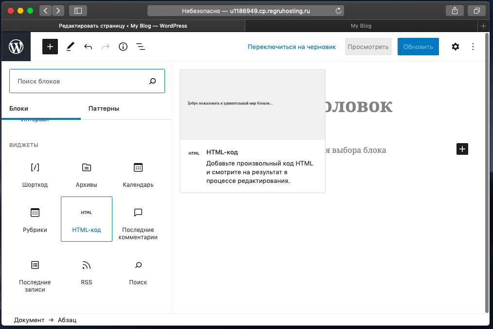
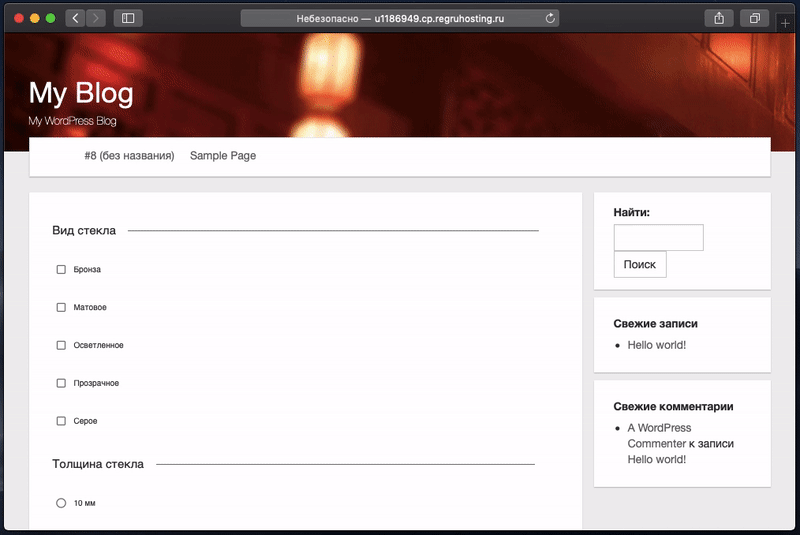

# wordpress-interop

> Применяем генератор форм на [React](https://reactjs.org/) при создании калькулятора стоимости услуг для сайта на Wordpress

## Введение

Очень часто, при выполнении студенческих или типовых работ на фрилансе, для сайтостроения можно применять готовые решения. Апофеозом подобных решений, на текущий момент, является связка [WordPress](https://ru.wordpress.org/) + [BuddyPress](https://buddypress.org/). BuddyPress это плагин, добавляющий к сайту на WordPress логику социальной сети - Лента активности, Профили, Друзья, Переписка, Группы. Отличительной особенностью связки является возможность применения сторонних плагинов для авторизации, например, OAuth через сервисы Facebook является [корпоративным стандартом стартапов силиконовой долины](https://www.upwork.com/freelance-jobs/wordpress/). Прискорбно, но *мышкой* это фатально быстрее программируется.


Однако, сочетать современные JavaScript фреймворки с WordPress и другими legacy решениями весьма сложно из-за повсеместной завязки на [WebPack](https://webpack.js.org/) или другие бандлеры. Под те же ограничения попадают студенческие сайты, которые в 2К20 в Российских институтах требуют верстать на [Bootstrap 3](https://getbootstrap.com/docs/3.4/) и [jQuery](https://jquery.com/).


Заучивание устаревших практик студентами убивает инициативу. Применение устаревших практик на работе тратит время на отладку, мир не просто так дошел до [контейнеров состояния](https://reactjs.org/docs/hooks-state.html). В сочетании с грядущей поддержкой ES6 модулей в браузере и [маппинге импортов](https://github.com/WICG/import-maps), подобная статья становится все более актуальной.


Маловероятно, что я свергну геронтократию в Российских проститутах (Привет, [Bootstrap v3](https://getbootstrap.com/docs/3.4/) и [jQuery](https://jquery.com/), во дворе 2К20), однако, может быть я могу помочь кому-то личностно...

## Пишем калькулятор для сайта

> В отличие от весьма шаблонной авторизации и регистрации, калькуляторы для сайтов всегда персонифицированы под бизнес - их проще писать императивно, а не прокликивать декларативно. Поэтому, приступим к написанию.

## Шаг 1 - создайте иерархию каталогов, сгруппировав фильтры

Можно попытаться попросить выдать такую структуру заказчика, но скорее всего придется делать самому. Подобный способ представления позволит наглядно осмотреть вложенность на предмет ошибок, в идеале переложить работу на чужие плечи...


В папке `src` данного каталога лежит древо папок и `index.js`, программа, которая будет создавать конфиг для генератора форм. Используя следующие скрипты, можно экспортировать древо каталогов как визуально (для описания, как в этой статье по аналогии с tree из dos), так и в формате json для [One](https://github.com/tripolskypetr/material-ui-umd/blob/master/packages/form-generator-app/STUDENTS.md) компонента.

```
npm start # Древо каталогов для быстрого осмотра на пригодность из консоли
#
# |-Вид стекла
# | |-Бронза
# | |-Серое
# | |-Толщина стекла
# | | |-10 мм
# | | |-Форма изделия
# | | | |-Круг

```

Вас интересует команда `npm run generate`. Команда `start` и `export` опциональны, рекомендованы к использованию только при желании разобраться с подкапотной работой инструмента.

```
npm run generate # JSON, на основе которого в автоматическом режиме будет построена форма
#
#  {
#    "type": "group",
#    "fields": [
#     {
#       "type": "line",
#       "title": "Вид стекла"
#     },
#     {
#       "title": "Бронза",
#       "type": "string",
#       "name": "Бронза"
#     },
#     {
#       "type": "group",
#       "fields": [
#         {
#           "type": "line",
#           "title": "Толщина стекла"
#         },
#         {
#           "title": "10 мм",
#           "type": "string",
#           "name": "10 мм"
#         },
#         {
#           "type": "group",
#           "fields": [
#             {
#               "type": "line",
#               "title": "Форма изделия"
#             },
#             {
#               "type": "group",
#               "fields": [
#                 {
#                   "type": "line",
#                   "title": "Круг"
#                 },
```

Примечание: после запуска `npm run generate` созданный файл `export.json` будет лежать в папке `material-ui-umd/packages/wordpress-interop/dist`.

## Шаг 2 - Создайте страницу, пропишите boilderplate

> Применять плагины не нужно, WordPress из коробки умеет добавлять на страницы кастомный html.



```

<script src="https://theonekit.github.io/index.js"></script>

<div id="mount-point"></div>

<script>
  (function () {

    const {
      createElement: h,
    } = React;

    const {
      One,
    } = form;

    const fields = /* Посмотрите index.html, много строчек */;

    const change = (obj) => console.log({ obj });

    const App = () => h(One, { fields, change });

    ReactDOM.render(h(App), document.getElementById('mount-point'));

  })()
</script>

```

## Шаг 3 - Скорректируйте json по вкусу, реализуйте коллбек `change`

> Посмотреть **как задавать число колонок** по ширине, **осуществлять скрытие**, **валидацию**, **отключение** полей исходя из входного значения, а так же **указать промис для загрузки сохраненных ранее данных** в форму можно [тут](../form-generator-app/STUDENTS.md).



Коллбек change будет вызываться после каждого изменения в созданной форме и передавать измененный объект с собранными значениями. Далее этот объект можно записать в `state` компонента и, после первого срабатывания `change`, сделать доступной кнопку сохранить.

One компонент разрабатывался в рамках `material-ui-umd` - библиотеки React компонентов для применения без бандлеров. Для соединения модулей используются [расширения глобального объекта](https://www.typescriptlang.org/docs/handbook/namespaces.html) и [деструктуризация](https://developer.mozilla.org/en/docs/Web/JavaScript/Reference/Operators/Destructuring_assignment). Посмотрите другие пакеты в [этом репозитории](https://github.com/tripolskypetr/material-ui-umd)
