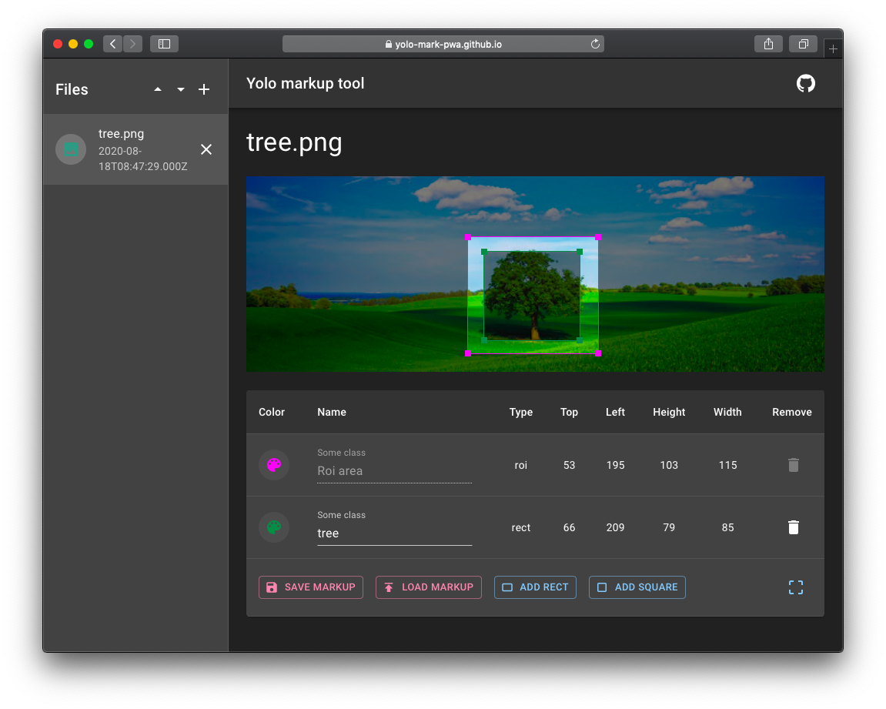

# yolo-mark-pwa

> Для удобства, собранная версия приложения размещена на Github Pages и доступна [по ссылке](https://yolo-mark-pwa.github.io/)

## Что это?

PWA для разметки [bounded boxes](https://en.wikipedia.org/wiki/Minimum_bounding_box) объектов на изображениях для обучения [нейронной сети Yolo](https://github.com/AlexeyAB/darknet) с поддержкой сенсорного ввода прямо в вашем веб-браузере. Выходной формат файлов разметки полносью совместим с оригинальным [Yolo_mark](https://github.com/AlexeyAB/Yolo_mark). Отличается лишь удобством работы: приложение умеет прямо в редакторе осуществлять обрезку [roi](https://en.wikipedia.org/wiki/Region_of_interest), поддерживает выделение прямоугольных и квадратных зон. Так же его не нужно компилировать



## Поддержка браузеров

Приложение протестировано на *Desktop Chrome 83*, *Desktop Firefox 77*, *Desktop Safari 12.1.1 on Mac OS 10.14.5*, проверку сенсорного ввода осуществил на ноутбуке Google Pixel, iPad.

## Как самостоятельно собрать

Если уже [собранная версия](https://yolo-mark-pwa.github.io/) вас чем-то не устраивает, можно сделать это самостоятельно...

 - Соберите umd дистрибутив, запустив команды ниже в корне копии этого репозитория

```
pwd # путь material-ui-umd
npm install
npm run build:umd
npm run build:types
```

 - После, соберите это приложение

```
pwd # путь material-ui-umd/packages/yolo-mark-pwa
npm run build
```
